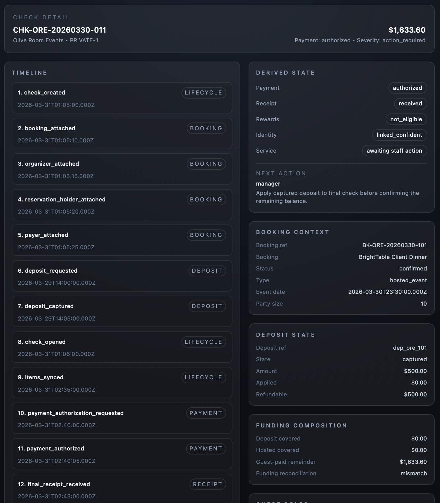
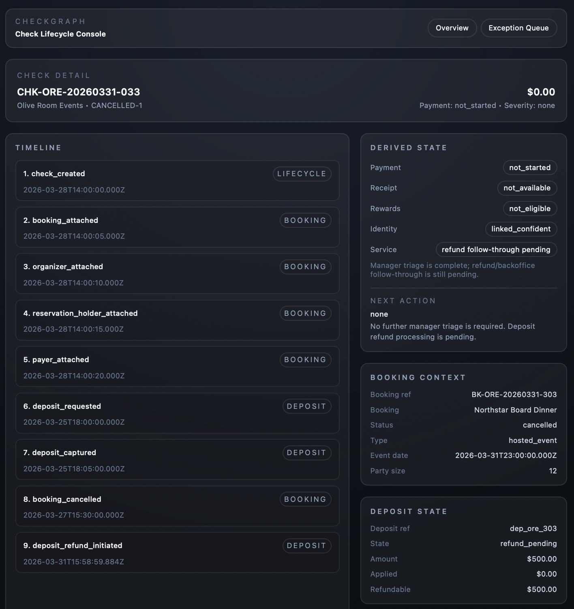

# Checkgraph

## 1. Overview
Checkgraph is an event-driven restaurant check operations and funding-reconciliation prototype.

Restaurant check issues are usually state-coordination problems, not single-table bugs. The hard cases show up when check lifecycle, captured deposits, hosted coverage, booking context, guest roles, operator actions, and support recovery drift out of sync. Checkgraph focuses on those messy states: unapplied hosted deposits, partial hosted coverage, and cancelled bookings that still need refund follow-through.

### Stack
- Next.js
- TypeScript
- PostgreSQL
- Drizzle ORM

### Proof
- real DB-backed writes
- recompute and projection updates in `derived_check_state`, `booking_deposits`, `check_allocations`, and `exceptions`
- audit log writes for operator actions
- support export regeneration after writes
- `npm run test:domain`, `npm run typecheck`, and `npm run build` all pass

## 2. Current status
### Mounted operator flows
- Apply Deposit To Check
- Apply Hosted Coverage To Check
- Mark Deposit For Refund
- Mark Payment Confirmed for fallback / terminal degradation

### Deferred from packaged surface
- Guest Detail
- Scenario Replay
- JSON export

## 3. Demo
- 60 to 90 second walkthrough
- 4 mounted operator flows shown end to end
- real Postgres-backed writes and recompute

## 4. Screenshots

*Hosted event check with a captured deposit, unapplied funding state, and operator action surface for deposit application.*

*Cancelled booking with `refund_pending` deposit state, refund follow-through service meaning, and no remaining manager triage.*

## 5. What is real vs simplified
### What is real
- real Postgres-backed writes
- append-only event stream
- recompute pipeline
- derived projections
- exception detection
- audited operator actions
- support export generation
- mounted fallback payment-confirmation recovery flow
- typecheck, tests, and production build passing

### What is simplified
- prototype role enforcement instead of full auth
- booking truth is partially row-backed
- packaged UI is intentionally narrow
- funding model is scoped to deposit + hosted credit + guest-paid remainder

## 6. High-signal files
- `lib/domain/` for reducer logic, exception rules, funding composition, and support summary generation
- `lib/server/checks/` for DB-backed loaders, write guardrails, and recompute orchestration
- `lib/db/schema/` for event and projection schema
- `tests/domain/` for scenario-driven domain tests

## 7. Mounted operator flows

### Mark Payment Confirmed
Operational problem:
- payment was authorized under fallback or terminal-degradation conditions, but the check still needs an explicit operator confirmation step before the recovery path can clear

Action:
- operator records a manual payment confirmation for the fallback case

What gets updated:
- `manual_override_applied` event is appended
- `mark_payment_confirmed` audit row is written
- fallback-related exceptions resolve
- derived state recomputes without pretending the external payment lifecycle changed

### Apply Deposit To Check
Operational problem:
- a booking deposit was captured before service, but it has not been applied to the final hosted check

Action:
- operator applies the captured deposit to the check

What gets updated:
- `deposit_applied_to_check` event is appended
- `check_allocations` projection gains the deposit allocation
- `booking_deposits` projection updates applied state
- derived state and exceptions are recomputed
- support export reflects the new funding composition

### Apply Hosted Coverage To Check
Operational problem:
- the booking has available hosted coverage, but the check still shows too much guest-paid remainder

Action:
- operator applies hosted coverage to the check

What gets updated:
- `hosted_credit_applied_to_check` event is appended
- hosted allocation is projected into `check_allocations`
- funding composition is recomputed
- the hosted-coverage exception resolves
- support export reflects deposit-covered, hosted-covered, and guest-paid portions

### Mark Deposit For Refund
Operational problem:
- a booking was cancelled after a deposit was captured, and the deposit outcome is still unresolved

Action:
- operator marks the deposit for refund processing

What gets updated:
- `deposit_refund_initiated` event is appended
- `booking_deposits` projection moves to `refund_pending`
- cancellation/deposit exception resolves
- next action shifts from manager triage to refund follow-through
- support export explains that refund processing is pending, not complete

## 8. Fallback payment recovery
Checkgraph includes a mounted, live-verified recovery slice for fallback and terminal-degradation cases.

### Mark Payment Confirmed
This slice demonstrates that payment truth and operational completion are separate concepts. In a network fallback / terminal-offline scenario, an operator can record a manual payment confirmation event, clear fallback-related exceptions, and move the check forward operationally without pretending the external processor lifecycle changed.

## 9. Canonical scenarios
- Network fallback payment recovery
  - payment is authorized under degraded terminal conditions and needs operator confirmation logic
- Delayed final receipt / rewards dependency
  - receipt arrival gates downstream rewards posting and exception resolution
- Payer vs reservation mismatch
  - the final payer and reservation context do not line up cleanly
- Hosted deposit unapplied
  - a captured deposit exists but has not been applied to the final check
- Hosted partial coverage
  - deposit is applied, hosted coverage is available, and a guest-paid remainder still exists
- Cancelled booking with active deposit
  - a booking is cancelled after deposit capture and the deposit outcome must move into refund follow-through

## 10. Guest role model
Checkgraph keeps guest roles operational and explicit rather than CRM-like:

- `primary guest`
  - the operationally primary guest for the check
- `payer`
  - the guest most directly associated with payment responsibility
- `reservation guest`
  - the reservation holder or booking-linked guest
- `organizer`
  - the person associated with hosted or event coordination

These roles can overlap, but the system does not assume they are the same person. That distinction matters for funding, support explanation, and operator recovery.

## 11. Runtime verification
This prototype was verified against a local Postgres-backed Next.js app, not only through unit tests or static compilation.

The live verification path included:

- real writes through mounted operator actions
- persisted event inserts in `check_events`
- persisted audit rows in `audit_logs`
- recompute-driven updates to `derived_check_state`
- recompute-driven updates to `booking_deposits`, `check_allocations`, and `exceptions`
- real support-export responses from the running app
- explicit rejection of invalid or repeated actions under server-side guardrails

The repo has also been run through:

- `npm run typecheck`
- `npm run test:domain`
- `npm run build`

## 12. What is intentionally simplified
- prototype role enforcement, not full auth
  - current write permissions are enforced server-side through a prototype role setting, not a full identity/session stack
- booking truth is currently mixed
  - booking status is row-backed in `event_bookings` plus event history, not a fully event-sourced booking subsystem
- export formats are intentionally narrow
  - Markdown and plain text are implemented
  - JSON export is deferred
- packaged UI scope is intentionally limited
  - Overview, Exception Queue, and Check Detail are the shipped surfaces
  - Guest Detail and Scenario Replay are deferred
- funding assumptions are intentionally narrow
  - current funding composition focuses on captured deposit, hosted credit, and guest-paid remainder
  - this is not a full event-accounting or refund platform

### Known limitations
- booking status is not yet derived entirely from booking events
- the current UI assumes a narrow deposit model and does not aim to support broad multi-deposit accounting
- invalid action handling is intentionally simple and uses inline action-level messages rather than richer per-field UI

## 13. Demo walkthrough
One strong 60 to 90 second walkthrough:

1. Start on `Overview` and explain that this is an operator recovery console, not a dashboard.
2. Open `CHK-NLB-20260328-022` and show fallback / terminal-degradation payment recovery with `Mark Payment Confirmed`.
3. Open `CHK-ORE-20260330-011` and show a captured deposit that was not yet applied.
4. Apply the deposit and show the timeline, derived state, exception resolution, and support export update.
5. Open `CHK-ORE-20260330-022` and show partial hosted coverage with remaining guest-paid balance.
6. Apply hosted coverage and show the funding split become explicit.
7. Open `CHK-ORE-20260331-033` and show the cancelled booking / captured deposit mismatch.
8. Mark the deposit for refund and show the shift from manager triage to refund follow-through pending.

## 14. Repo structure
High-signal parts of the repo:

- `app/`
  - Next.js App Router entrypoints for Overview, Exception Queue, Check Detail, and support export
- `features/checks/`
  - mounted operator actions and check-detail UI components
- `features/exceptions/`
  - exception queue UI
- `lib/db/schema/`
  - Drizzle schema for checks, events, projections, exceptions, bookings, deposits, and allocations
- `lib/db/seed/`
  - canonical scenarios and seed inputs
- `lib/domain/`
  - reducer logic, exception rules, funding composition, deposit projection, and support-summary generation
- `lib/server/checks/`
  - DB-backed loaders, recompute orchestration, and write guardrails
- `drizzle/`
  - SQL migrations
- `tests/domain/`
  - scenario-based domain tests

### Docs map
- `README.md`
  - public repo overview and demo framing
- `checkgraph_docs/HOSTED_CHECK_DEPOSIT_RESOLUTION_PRD.md`
  - active product framing for the current hosted/deposit prototype
- `checkgraph_docs/HOSTED_CHECK_DEPOSIT_SCHEMA_AND_SEEDS.md`
  - active schema, seed, and scenario contract
- `checkgraph_docs/PHASE2_BUILD_DELTA.md`
  - active implementation delta against the earlier base
- `checkgraph_docs/CODEX_BUILD_GUIDE.md`
  - build/execution companion for the active Phase 2 branch
- `checkgraph_docs/PRE_BUILD_DECISIONS.md`
  - locked architectural decisions for the current prototype
- `checkgraph_docs/archive/`
  - archived earlier specs and build-status notes, kept for history rather than current guidance

## 15. Setup
Local setup is intentionally lightweight and still a bit manual.

Minimum verified workflow:

1. install dependencies
   - `npm install`
2. provide a Postgres database via `DATABASE_URL`
3. apply the SQL migrations in `drizzle/`
4. seed the database
   - `npm run seed`
5. start the app
   - `npm run dev`

Validation commands:

- `npm run typecheck`
- `npm run test:domain`
- `npm run build`

The repo has been live-verified against a local Postgres-backed environment, but the bootstrap flow is still intentionally simple rather than fully automated.

## 16. Future extensions
- make booking truth fully event-driven instead of row-backed plus history
- add richer integration-style tests around live write flows and rejection paths
- extend support export and operator detail only where it improves recovery, not surface area

### What I’d improve next
- add first-class in-form handling for rejected actions instead of raw server-error responses
- add one request-context smoke test for a second mounted flow beyond deposit application
